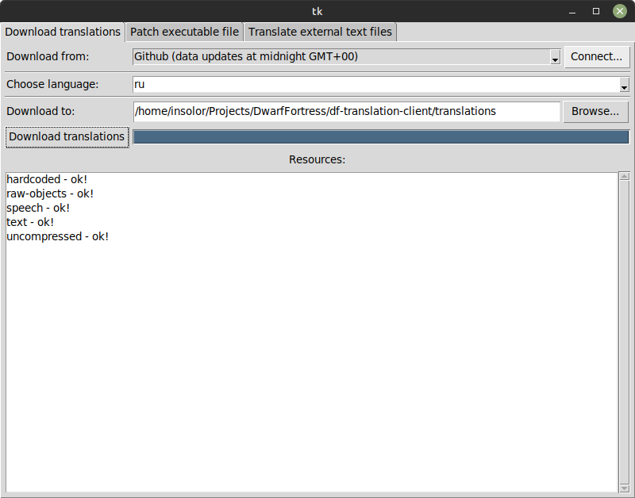

# DF Translation Client
[](https://github.com/dfint/df-translation-client/actions?query=workflow%3A"Python+application")
[](https://coveralls.io/github/dfint/df-translation-client?branch=develop)
[](https://codeclimate.com/github/dfint/df-translation-client/maintainability)

A GUI client intended to simplify usage of all the utils of the localization project (https://github.com/dfint/).

## Installation

* [Python 3](https://www.python.org) must be installed (version 3.7 or higher).  
    Also, on Linux tkinter library must be installed (e.g. run `sudo apt install python3-tk` on Ubuntu).
* Download project as zip archive and unpack it (or just clone with git if you know how to use it)
* Install `poetry`, then install the package with the following commands from the command line:
    ```bash
    pip install poetry
    poetry install
    ```
    (use `pip3` instead of `pip` on Linux)

* Double click `df-translate.pyw` file or run the application from the command line:

    `poetry run df-translate`


